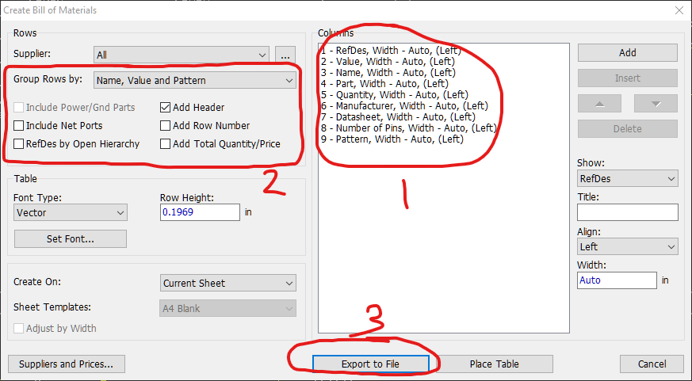
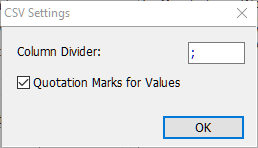

# ComponentManager

by Dominic Clifton. (C) 2018-2023

Utilities to manage costing/pricing for PCB assembly.

## Background

When designing PCBs for you often need to know the price or cost of a design, a price when it's a new design and you
don't have component stock, or cost if you've already purchased components.

Often you will buy more components than you need because they have minimum order quantities or come in media that holds
a fixed amount.  When this happens you seek to use these components before either changing to a different component
or simply ordering more.

EDA tools, like DipTrace often don't use a specific part because in many cases multiple suppliers can provide parts.
For example, you often specify the minimum specification, such as 100nF 6.3V 20% capacitor, but in reality you can often
use a higher specification part, such as a 100nF 50V 10% capacitor.

There are other constraints too, like how many feeders your pick and place machine has, product shelf-life, etc.  These
constraints often cause you to reduce the number of different components you stock, so that you can use them all before
they go bad, or so that you can use them in multiple different designs.  e.g.  why stock the lower specification part
if it's almost the same price as the higher specification part which can be used in more designs?

As a manufacturer you often have to use multiple suppliers due to pricing, availability and shipping concerns.

Pricing is further complicated by fluctuating prices and fluctuating exchange rates.

Given the above, what you end up with is a time-consuming nightmare of manually cross-referencing data from multiple
sources which cannot be easily updated.

Also, if the process of getting a price is complicated, then it makes the practice of design-to-a-price much more
difficult as you cannot easily see how adding components changes the price.

Some EDA tools have BOM-integrations with suppliers, however that creates lock-in in both the EDA tool and supplier list,
as well as limiting your choice of components in the EDA tool.  EasyEDA/LCSC/JLPCB being such an example of such lock-in.
You have to ask yourself, what if I need this made, but JLPCB don't do blind-vias and LCSC doesn't stock the part?

## Scope

The tools in this project seeks to reduce your workload by:

* Collating purchase history from multiple suppliers so it can be easily searched, exported and reused.
* Define a simple format for globally mapping design specifications to orderable components.
* Define a simple format for part substitutions, to allow for component library re-use.
* Producing a cost, given a BOM, purchase history, mappings and substitution lists.

## Supported suppliers

* LCSC
* Mouser
* Farnell
* Digikey

Supported for other suppliers is planned.
Adding a supplier support is reasonably straightforward though as long as the supplier's website allows you to export one
or more CSV files containing: order date, supplier reference, manufacturer reference, manufacturer, cost and currency. 
The order reference also needs to be determined, usually either from the filename or from the data in the exported file. 

It's technically possible to support suppliers using their website APIs.
In practice suppliers generally can't get a simple order history export to CSV working
so YMMV if you try to use their APIs... See developer notes in the code for examples of broken-ness and pain.

## Workflow

The workflow is currently:

1) Export your past purchases (orders) from supported suppliers (e.g. LCSC) into supported input formats (e.g. CSV) 

2) Create a `.json` client credentials file to allow the tool to access google sheets

Get credentials from the Google API Console, steps:
* Click 'APIs and Services'
* Click 'Credentials'
* Click 'OAuth 2.0 Client IDs'
* Then create one, and download the 'Client secrets' `.json` file and store it as-required, store as `credentials/user-credentials.json`.

Reference 1: https://developers.google.com/api-client-library/java/google-api-java-client/oauth2
Reference 2: https://console.cloud.google.com/apis/credentials/oauthclient

Example URL: https://console.cloud.google.com/welcome?pli=1&project=component-manager-319920

3) Create a per-user config file for the tool, so it can access google sheets via the API.

```
sheetId=1DyAAXeNf1tS25ZWaWHjedyReiUt_goo17hTRhCHcDsQ
credentials=credentials/user-credentials.json
```

store as `configs/user.config`

The sheetId is the ID of the purchase history spreadsheet that the tool will update.

3) Create a config file so you don't have to remember all the command line arguments every time you run the tool:

```
-u
-cfg configs/user.config
#-sd "D:\\My Documents\\Purchasing\\LCSC\\Orders"
#-sd "D:\\My Documents\\Purchasing\\Mouser\\Part History"
-sd "D:\\My Documents\\Purchasing\\Farnell\\Orders"
```

Store as `@configs\user.purchasecombiner`.

Refer to [command line arguments](#command-line-arguments) below.

Note: The tool can work with multiple source directories, enable/disable the source directory
arguments as appropriate by adding/removing the `#` prefix and re-running the tool.

4) Run PurchaseCombiner to update a purchase history spreadsheet (e.g. on google sheets via the Google Sheets API) 
note: currently running purchase combiner multiple times will create duplicate rows in the spreadsheet but is non-destructive, 
recommended to use version control on the generated file so that it can be reverted if required.
when using google sheets export you can enable version history for the file in google sheets.

```
purchasecombiner @configs\user.purchasecombiner
```

5) Manually append line items to the spreadsheet for purchases from unsupported suppliers.

6) Export BOM from EDA tool (DipTrace)





save as CSV file, e.g. `DesignName-RevA-YYYYMMDD-HHMM-BOM.csv`

7) Create Name Pattern + Value Pattern to Name + Value part substitutions spreadsheet in google sheets or a CSV file for the project (design specific substitutions)

Regular expressions are supported in the patterns.  You can use online regular expression tools, like [regex101.com](http://regex101.com), to test your regular expressions.

e.g.
```csv
"Name Pattern";"Value Pattern";"Name";"Value"
"CAP_0402";"2.2uF 6.3V 0402";"CAP_0402";"2.2uF 10V 0402 X5R 10%"
"LED 0603 RED 250MCD";"/.*/";"LED 0603 RED",""
```

8) Create Name + Value to Order-code & Manufacturer substitutions spreadsheet in google sheets or a CSV file for each component to be used. (an EDA to order-code mapping)

Regular expressions are supported in the patterns here too.

```csv
"Name Pattern";"Value Pattern";"Part Code";"Manufacturer"
"CAP_0402";"2.2uF 10V 0402 X5R 10%";"CL05A225KP5NSNC";"Samsung Electro-Mechanics"
"SM04B-SRSS-TB";"/.*/";"AFC10-S04QCC-00";"JUSHUO"
```

9) Create a per-design config file for the tool so it can find all the files.

```
-c
-cfg configs/user.config
-b "D:\\My Documents\\DipTrace\\Projects\\DesignName\\DesignName-RevA-YYYYMMDD-HHMM-BOM.csv"
-ps https://docs.google.com/spreadsheet/ccc?key=aaaaaaaaaaaa_aaaaaaaaa-aaa-aaaaaaaaaaaaaa-aa&gid=0&output=csv
-p https://docs.google.com/spreadsheet/ccc?key=bbbbbbbbbbbbbbbbbbbbbbbbbbbb_bbbbbbbbbbbbbbb&gid=0&output=csv
-pm https://docs.google.com/spreadsheet/ccc?key=cccccccccccccccccccccccccccccccccccccccccccc&gid=dddddddddd&output=csv
-o "C:\\My Documents\\DipTrace\\Projects\\DesignName\\DesignName-RevA-YYYYMMDD-HHMM-BOM-COST.csv"
```
save as `configs/DesignName-RevA-YYYYMMDD-HHMM-BOM.bomcost`

Refer to [command line arguments](#command-line-arguments) below.

10) Run BOMCost to calculate the cost for the BOM, tell it to get the program arguments from a file using the `@` symbol:

`bomcost @configs/DesignName-RevA-YYYYMMDD-HHMM-BOM.bomcost`

It will print out the costs of previously-ordered parts and sum the currencies used.

It applies part substitutions first, then searches the part mappings to find the part and its price by using the manufacturer's part number.
If there are more than one possible substitution it will use the first one encountered, you can re-order substitutions in the part substitution file as you prefer.

e.g.

```
CAP_0402, 2.2uF 6.3V 0402 -> CAP_0402, 2.2uF 10V 0402 X5R 10% -> Manufacturer: Samsung Electro-Mechanics, Part Code: CL05A225KP5NSNC, Supplier: LCSC, Order reference: 20200101AAAA, Order date: 2020-01-01, Unit price: 0.0034 USD
SM04B-SRSS-TB, RX -> Manufacturer: JUSHUO, Part Code: AFC10-S04QCC-00, Supplier: LCSC, Order reference: 20210101BBBB, Order date: 2021-01-01, Unit price: 0.0444 USD
RES_0402, 1K 0402 5% -> Manufacturer: TE CONNECTIVITY, Part Code: CRGCQ0402J1K0, Supplier: Farnell, Order reference: 12344321, Order date: 2019-01-01, Unit price: 0.0020 EUR
Unmatched BOM items
CAP_0402, 4.7uF 6.3V 0402 X5R 10%, [C4, C11]
	Substituted from CAP_0402, 4.7uF 6.3V 0402 10%
	0 -> Manufacturer: YAGEO, Part Code: CC0402KRX5R5BB475
SOLDER_PAD, , [SP7, SP8]
Cost: [USD:9.9999, EUR:8.8888, GBP:7.7777]
```

The resulting CSV file will contain data like this:
```csv
"REFDES", "NAME","VALUE","SUBSTITUTE_NAME","SUBSTITUTE_VALUE","MANUFACTURER","PART_CODE","SUPPLIER","ORDER_REFERENCE","ORDER_DATE","QUANTITY","UNIT_PRICE","LINE_PRICE","CURRENCY"
"C1, C2","CAP_0402","2.2uF 6.3V 0402","CAP_0402","2.2uF 10V 0402 X5R 10%","Samsung Electro-Mechanics","CL05A225KP5NSNC","LCSC","2020101AAAA","2020-01-01","3","0.0034","0.0102","USD"
```

It's also possible to then:

11) Check your inventory against the selected BOM components.
12) Order new/out-of-stock parts, sometimes by uploading the resulting 'bom-cost.csv' to a supplier.

## Limitations

PurchaseCombiner
 * Doesn't handle duplicates and just inserts rows, see workflow.  Ensure you don't attempt to re-import order files; However, reverting a Google sheets file using revision history is easy.
 - Arrow support is planned.
 + It's still much quicker than doing it manually.
 
BOMCost
 - None, it's functional now.

## Building

Requires 'pnpconvert' as a sibling to the 'componentmanager' directory so that gradle can find it.

## Testing

`gradlew test`

## Installation

`gradlew installDist`

## Running

Only from IDE at the moment.  Run `main()` in BOMCost.groovy or PurchaseCombiner.groovy

## Command line arguments

The tools can be run with no aguments and they will print the help.

### BOMCost

```
BOMCost (C) 2023 Dominic Clifton
Written by Dominic Clifton
Usage: bomcost
-b=<bom>                 BOM file/url
-c                       calculate
-cfg=<config>        configuration file (in "key=value" format)
-o=<output>              output file (csv)
-p=<purchases>           purchases file/url
-pm=<partmappings>   part mappings file/url
-ps=<partsubstitutions>
part substitutions file/url
-v                       version
```

### Purchase Combiner

```
PurchaseCombiner (C) 2023 Dominic Clifton
Written by Dominic Clifton
Usage: purchasecombiner
  -c=<credentials>    credentials json file/url
      -cfg=<config>   configuration file (in "key=value" format)
  -s=<sheet>          sheet id
      -sd=<sourceDirectory>
                      source directory
  -u                  update
  -v                  version
```

## DipTrace Export Settings

Export a CSV file.
Group rows by: `Name, Value and Pattern`
Column divider: `;`
Add Row Number: No
Add Total Quantity/Price: No

Header:
```csv
RefDes;"Value";"Name";"Part";"Quantity";"Manufacturer";"Datasheet";"Number of Pins";"Pattern"
```

Also screenshots in [Workflow](#workflow) above.
